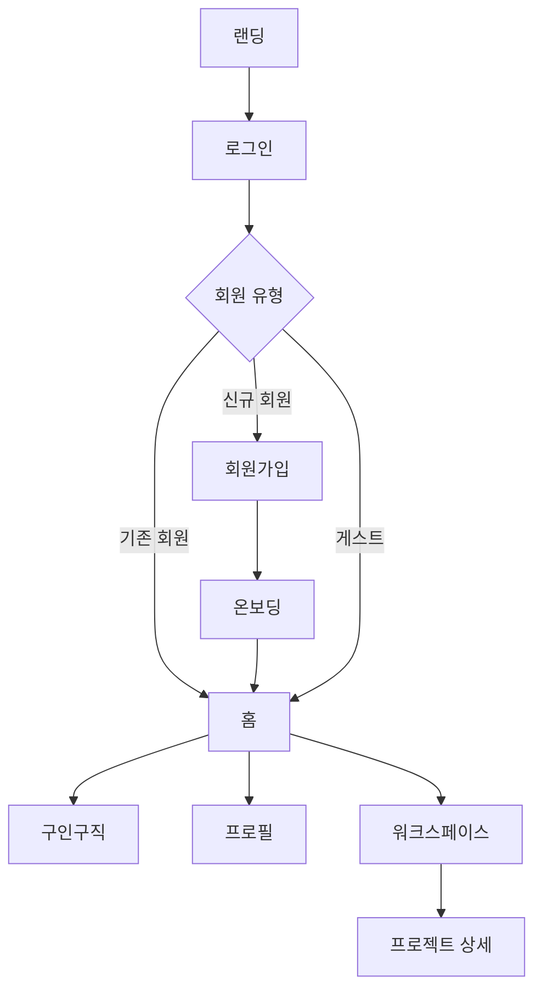

# SLATE-TO FE

> 영상 제작자를 위한 협업 워크스페이스

## 프로젝트 소개

SLATE-TO는 영상 제작자들이 구인구직, 프로젝트 관리, 팀 협업을 한 곳에서 처리할 수 있는 워크스페이스 서비스입니다.

## 팀원 및 역할 분담

| 이름 | 담당 페이지 | 담당 공용 컴포넌트 |
| --- | --- | --- |
| 클레버 | 워크스페이스 · 프로젝트 상세 (영상 피드백) | TextArea · YouTube Iframe Player · Dropdown |
| 디아 | 로그인 / 인증 (토큰 · 소셜 · 라우팅 가드) | Input · 프로젝트 카드 · 영상 미리보기 · 태그 |
| 이브 | 온보딩 · 홈 · 캘린더 · 알림 | Button · Calendar |
| 재희 | 레이아웃 (골격) · 구인구직 · 마이페이지 · 전역 스타일 | ProgressBar · 구인구직 카드 · Modal |


## 기술 스택

| 분류 | 기술 |
| --- | --- |
| Framework | React 19, TypeScript, Vite |
| Styling | Tailwind CSS 4 |
| 상태 관리 | Zustand 5 |
| 유효성 검사 | Zod 4 |
| 코드 품질 | ESLint, Prettier |
| 배포 | Vercel |

## 폴더 구조

```
SLATE_TO_FE/
├── .vscode/
├── public/
├── src/
│   ├── api/              # API 호출
│   ├── assets/
│   │   ├── images/
│   │   └── fonts/
│   ├── components/       # 공통 컴포넌트
│   ├── hooks/            # 커스텀 훅
│   ├── layouts/          # 공통 레이아웃
│   ├── pages/            # 라우트 단위 페이지
│   ├── schemas/          # Zod 스키마
│   ├── stores/           # Zustand 스토어
│   ├── types/            # 전역 타입
│   └── utils/            # 순수 함수
├── .editorconfig
├── .env.example
├── eslint.config.js
├── vite.config.ts
└── tsconfig.json
```

## 브랜치 전략

```
main        # 배포 브랜치
└── dev     # 통합 브랜치
    └── feature/이름-기능명   # 기능 개발 브랜치 (예: feature/kcleverp-login)
```

- 모든 작업은 `feature/이름-기능명` 브랜치에서 시작
- `feature` → `dev` PR 후 팀장 코드 리뷰 필수
- dev merge 후 통합 테스트 진행
- `dev` → `main` 은 배포 시점에만 병합
- 모든 변경사항은 GitHub 이슈로 기록

## 네이밍 규칙

| 대상 | 규칙 | 예시 |
| --- | --- | --- |
| 컴포넌트 파일/폴더 | PascalCase | `VideoPlayer.tsx` |
| 함수 / 변수 / 커스텀 훅 | camelCase | `isLoggedIn`, `useAuth.ts` |
| 레포지토리 / 브랜치 | kebab-case | `slate-to-fe`, `feature/kcleverp-login` |

## 커밋 컨벤션

```
type: 내용 (#이슈번호)
```

| type | 설명 |
| --- | --- |
| `feat` | 새로운 기능 |
| `fix` | 버그 수정 |
| `style` | 코드 포맷, 세미콜론 등 (로직 변경 없음) |
| `refactor` | 리팩토링 |
| `chore` | 빌드 설정, 패키지 관리 |
| `docs` | 문서 수정 |

예시:

```
feat: 로그인 페이지 UI 구현 (#12)
- 이메일/비밀번호 입력 폼 추가
- 유효성 검사 로직 구현
- 소셜 로그인 버튼 배치
```

## PR 컨벤션

- 제목: `type: 작업 내용` (예: `feat: 로그인 페이지 구현`)
- 팀장 리뷰 후 머지
- PR 단위는 화면 또는 기능 단위로 분리
- UI 변경이 있으면 스크린샷 첨부
- 리뷰 포인트가 있으면 본문에 작성
- PR 본문은 [템플릿](.github/PULL_REQUEST_TEMPLATE.md)을 따릅니다

## 스타일 가이드

폰트와 색상은 `src/index.css`의 `@theme`에 CSS 변수로 정의되어 있습니다.

**폰트**: Pretendard

크기와 굵기를 조합해서 사용합니다.
- 크기: `text-head-lg` / `text-head-md` / `text-head-sm` / `text-body-lg` / `text-body-sm` / `text-caption-lg` / `text-caption-sm`
- 굵기: `font-bold` / `font-semibold` / `font-normal`

**색상**
- **Primitive** — 디자인 시스템 원본 팔레트 (`bg-main-7`, `text-neutral-6` 등)
- **Semantic** — 용도 기반 별칭으로 Primitive를 참조 (`bg-primary`, `bg-secondary` 등)
- 가능하면 Semantic 우선 사용, 없는 경우 Primitive 직접 사용

## 실행 방법

```bash
# 패키지 설치
npm install

# 개발 서버 실행
npm run dev

# 빌드
npm run build
```

환경변수는 `.env.example`을 참고해 `.env.local` 파일을 생성하세요.

## 화면 목록 및 플로우

| 영역 | 화면 |
| --- | --- |
| 진입 | 랜딩, 로그인, 회원가입, 약관 |
| 온보딩 | 역할 선택, 지역, 카테고리, 프로필 설정 |
| 홈 | 대시보드, 캘린더, 할일, 알림 |
| 구인구직 | 공고 목록, 인력풀 |
| 프로필 | 마이 프로필, 공개 프로필, 북마크 |
| 워크스페이스 | 프로젝트 목록, 설정, 공지, 활동 |
| 프로젝트 상세 | 대시보드, 일정, 파일, 피드백 |


