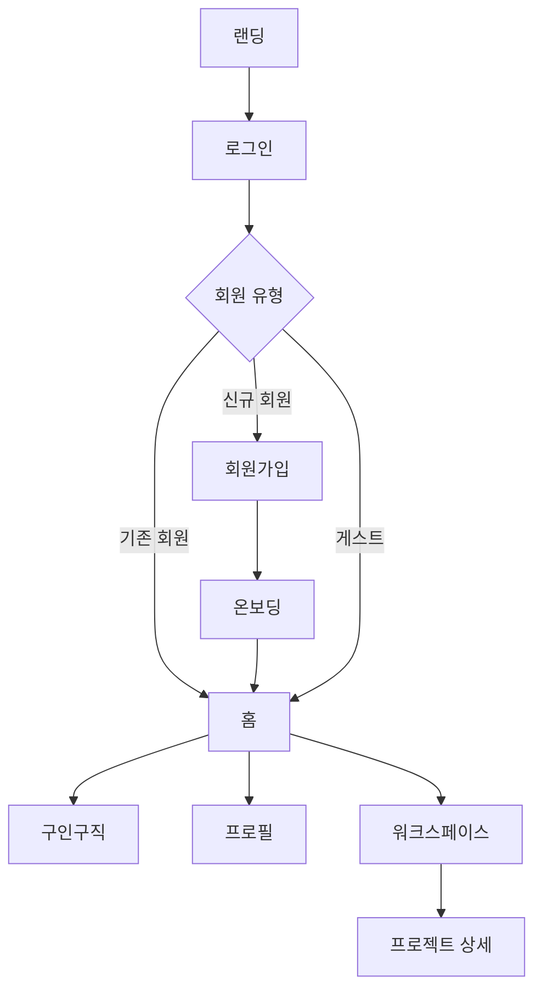

# SLATE-TO FE

> 영상 제작자를 위한 협업 워크스페이스

## 프로젝트 소개

SLATE-TO는 영상 제작자들이 구인구직, 프로젝트 관리, 팀 협업을 한 곳에서 처리할 수 있는 워크스페이스 서비스입니다.

## 팀원 및 역할 분담

| 이름   | 담당 페이지                                           | 담당 공용 컴포넌트                                                         |
| ------ | ----------------------------------------------------- | -------------------------------------------------------------------------- |
| 클레버 | 워크스페이스 · 프로젝트 상세 (영상 피드백)            | TextArea · YouTube Iframe Player · Select · Choice · ActionMenu            |
| 디아   | 로그인 / 인증 (토큰 · 소셜 · 라우팅 가드)             | Input · 프로젝트 카드 · 영상 미리보기 · Tag · FileInput                    |
| 이브   | 온보딩 · 홈 · 캘린더 · 알림                           | Button · Calendar(라이브러리) · Avatar · DatePicker                        |
| 재희   | 레이아웃 (골격) · 구인구직 · 마이페이지 · 전역 스타일 | ProgressBar · 구인구직 카드 · Modal(껍데기+ConfirmModal) · Tabs · 레이아웃 |

## 기술 스택

| 분류        | 기술                       |
| ----------- | -------------------------- |
| Framework   | React 19, TypeScript, Vite |
| Styling     | Tailwind CSS 4             |
| 상태 관리   | Zustand 5                  |
| 유효성 검사 | Zod 4                      |
| 코드 품질   | ESLint, Prettier           |
| 배포        | Vercel                     |

## 폴더 구조

```
SLATE_TO_FE/
├── .vscode/
├── public/
├── src/
│   ├── api/              # API 호출
│   ├── assets/
│   │   ├── images/
│   │   ├── icons/        # 아이콘 SVG (Flaticon UIcons)
│   │   └── fonts/
│   ├── components/       # 공통 컴포넌트
│   ├── hooks/            # 커스텀 훅
│   ├── layouts/          # 공통 레이아웃
│   ├── pages/            # 라우트 단위 페이지
│   ├── schemas/          # Zod 스키마
│   ├── stores/           # Zustand 스토어
│   ├── types/            # 전역 타입
│   └── utils/            # 순수 함수
├── .editorconfig
├── .env.example
├── eslint.config.js
├── vite.config.ts
└── tsconfig.json
```

## 브랜치 전략

```
main        # 배포 브랜치
└── dev     # 통합 브랜치
    └── feature/이름-기능명   # 기능 개발 브랜치 (예: feature/kcleverp-login)
```

- 기능 개발은 `feature/이름-기능명` 브랜치에서 시작
- 문서·설정·버그 등 비기능 작업은 `docs/`·`chore/`·`fix/` prefix 사용 (예: `docs/kcleverp-readme-convention`)
- `feature` → `dev` PR 후 팀장 코드 리뷰 필수
- dev merge 후 통합 테스트 진행
- `dev` → `main` 은 배포 시점에만 병합
- 모든 변경사항은 GitHub 이슈로 기록

## 네이밍 규칙

| 대상                    | 규칙       | 예시                                    |
| ----------------------- | ---------- | --------------------------------------- |
| 컴포넌트 파일/폴더      | PascalCase | `VideoPlayer.tsx`                       |
| 함수 / 변수 / 커스텀 훅 | camelCase  | `isLoggedIn`, `useAuth.ts`              |
| 레포지토리 / 브랜치     | kebab-case | `slate-to-fe`, `feature/kcleverp-login` |

## 커밋 컨벤션

```
type: 내용 (#이슈번호)
```

| type       | 설명                                    |
| ---------- | --------------------------------------- |
| `feat`     | 새로운 기능                             |
| `fix`      | 버그 수정                               |
| `style`    | 코드 포맷, 세미콜론 등 (로직 변경 없음) |
| `refactor` | 리팩토링                                |
| `chore`    | 빌드 설정, 패키지 관리                  |
| `docs`     | 문서 수정                               |

예시:

```
feat: 로그인 페이지 UI 구현 (#12)
- 이메일/비밀번호 입력 폼 추가
- 유효성 검사 로직 구현
- 소셜 로그인 버튼 배치
```

## PR 컨벤션

- 제목: `type: 작업 내용` (예: `feat: 로그인 페이지 구현`)
- 팀장 리뷰 후 머지
- PR 단위는 화면 또는 기능 단위로 분리
- UI 변경이 있으면 스크린샷 첨부
- 리뷰 포인트가 있으면 본문에 작성
- PR 본문은 [템플릿](.github/PULL_REQUEST_TEMPLATE.md)을 따릅니다

## 스타일 가이드

폰트와 색상은 `src/index.css`의 `@theme`에 CSS 변수로 정의되어 있습니다.

**폰트**: Pretendard

크기와 굵기를 조합해서 사용합니다.

- 크기: `text-head-lg` / `text-head-md` / `text-head-sm` / `text-body-lg` / `text-body-sm` / `text-caption-lg` / `text-caption-sm`
- 굵기: `font-bold` / `font-semibold` / `font-normal`

**색상**

- **Primitive** — 디자인 시스템 원본 팔레트 (`bg-main-7`, `text-neutral-6` 등)
- **Semantic** — 용도 기반 별칭으로 Primitive를 참조 (`bg-primary`, `bg-secondary` 등)
- 가능하면 Semantic 우선 사용, 없는 경우 Primitive 직접 사용

## 공용 폼 컨트롤 규약

> Input · TextArea · Select · Choice · ChoiceGroup · Button 등 폼 컨트롤을 여러 명이 동시에 만들 때 props가 어긋나 폼 화면(회원가입·공고작성·설정)에서 충돌하는 것을 막기 위한 최소 규약입니다. 기준 템플릿은 이미 구현된 `src/components/TextArea.tsx`.

### 컴포넌트 네이밍

| 이름          | 용도                                                                    |
| ------------- | ----------------------------------------------------------------------- |
| `Choice`      | 단일 checkbox / radio (`type`, `shape`)                                 |
| `ChoiceGroup` | 옵션 배열형 — `radio` → `value: string`, `checkbox` → `value: string[]` |
| `Select`      | 드롭다운 단일선택 (값 저장). 콤보박스(직접입력)는 후순위                |
| `Tabs`        | 콘텐츠 탭 (GNB·사이드바와 다름)                                         |

### Input / FileInput / ActionMenu

| 이름         | 용도                                                                                     |
| ------------ | ---------------------------------------------------------------------------------------- |
| `Input`      | **문자열** 입력 (로그인, 검색, 일반 폼). `value: string`, `onChange(string)`             |
| `FileInput`  | **파일** 선택·업로드 (프로젝트 파일 추가 등). `Input`과 별도 컴포넌트                    |
| `ActionMenu` | 트리거(⋯ 등) + **액션 목록** (`onClick` 실행). **폼 필드 아님** — 공통 props 규약 미적용 |

- `Select`(값 선택)와 `ActionMenu`(동작 실행)는 용도가 다름
- `ActionMenu` v1은 트리거 + `items[]` + 열림/닫기 수준으로 시작

### 공통 props

| prop                 | 타입       | 동작                                                           |
| -------------------- | ---------- | -------------------------------------------------------------- |
| `label`              | `string?`  | 라벨. input `id`와 `htmlFor`로 연결 (`id`는 미전달 시 `useId`) |
| `required`           | `boolean?` | `true`면 label 옆 `*` 표시 + input에 `aria-required`           |
| `hint`               | `string?`  | 안내 문구. `error`가 없을 때만 회색 표시                       |
| `error`              | `string?`  | 에러 메시지. 있으면 `hint`보다 우선, `text-warning` 색         |
| `value` / `onChange` | controlled | 값은 부모가 보유 (controlled)                                  |
| `disabled`           | `boolean?` | 비활성 상태                                                    |

```tsx
// 라벨 — input의 id와 htmlFor 연결, *는 필수 표시
{
  label && (
    <label htmlFor={id}>
      {label}
      {required && <span className="text-warning">*</span>}
    </label>
  )
}

// 메시지 — error가 hint보다 우선 (aria-describedby로 input과 연결)
{
  ;(error || hint) && (
    <span className={error ? 'text-warning' : 'text-neutral-5'}>{error ?? hint}</span>
  )
}
```

### Zod 검증 흐름

- **스키마는 부모(페이지)가 보유**, 컴포넌트는 `error` 문자열만 받아 표시한다.
- **필드별**: `onBlur`에서 해당 필드만 검증 → 부모 state 저장 → `error` prop으로 전달
- **제출 시**: 전체 스키마로 다시 검증 (blur를 안 거친 필드 + 교차 필드까지)
- 교차 필드 규칙(예: 비밀번호 == 비밀번호 확인)은 **제출 시점에만** 잡힌다.

> ⚠️ `.refine()`가 붙은 스키마는 `.shape`가 없습니다. 필드별 검증을 위해 **base 객체와 refine을 분리**하세요.

```ts
// src/schemas/...
const base = z.object({ password: /* ... */, passwordConfirm: /* ... */ })
export const signupSchema = base.refine(
  (v) => v.password === v.passwordConfirm,
  { message: '비밀번호가 일치하지 않습니다', path: ['passwordConfirm'] },
)
// 필드별 blur 검증 → base.shape.password (.shape 살아있음)
// 제출 검증        → signupSchema.safeParse(전체 값)
```

```ts
// src/utils/validateField.ts — 필드 하나 검증, 에러 메시지만 반환
export function validateField<T extends z.ZodTypeAny>(schema: T, value: unknown) {
  const result = schema.safeParse(value)
  return result.success ? '' : result.error.issues[0].message
}
```

### variant / size — 이름만 공유

```ts
// src/types/ui.ts
export type Variant = 'primary' | 'secondary' | 'ghost'
export type Size = 'sm' | 'md' | 'lg'
```

- prop **이름·값 종류만** 통일. 실제 Tailwind 매핑은 컴포넌트마다 자유 (Button의 `primary` ≠ Tag의 `primary` 생김새)
- cva 등 새 라이브러리 도입 없음 — TextArea가 쓰는 객체 매핑 방식 그대로

### 적용 범위

- 이미 작업 중인 컴포넌트는 갈아엎지 않고 **다음 작업분부터 적용**
- 반대 의견은 PR 또는 디스코드 `front`에 회신, 없으면 이대로 진행

## 실행 방법

```bash
# 패키지 설치
npm install

# 개발 서버 실행
npm run dev

# 빌드
npm run build
```

환경변수는 `.env.example`을 참고해 `.env.local` 파일을 생성하세요.

## 화면 목록 및 플로우

| 영역          | 화면                                                                                |
| ------------- | ----------------------------------------------------------------------------------- |
| 진입          | 랜딩, 로그인/게스트 로그인, 회원가입, 약관, 비밀번호 재설정, 초대 진입(팀원/게스트) |
| 온보딩        | 역할 선택, 지역, 카테고리, 프로필 설정                                              |
| 홈            | 대시보드(오늘의 브리핑·진행 중 프로젝트·추천 공고·미니 캘린더), 통합 캘린더, 알림   |
| 구인구직      | 공고 목록, 공고 작성/상세, 나의 구인구직, 지원자 확인                               |
| 프로필        | 마이 프로필, 공개 프로필, 북마크                                                    |
| 워크스페이스  | 프로젝트 목록, 설정, 공지, 활동                                                     |
| 프로젝트 상세 | 대시보드, 일정, 파일, 피드백                                                        |


